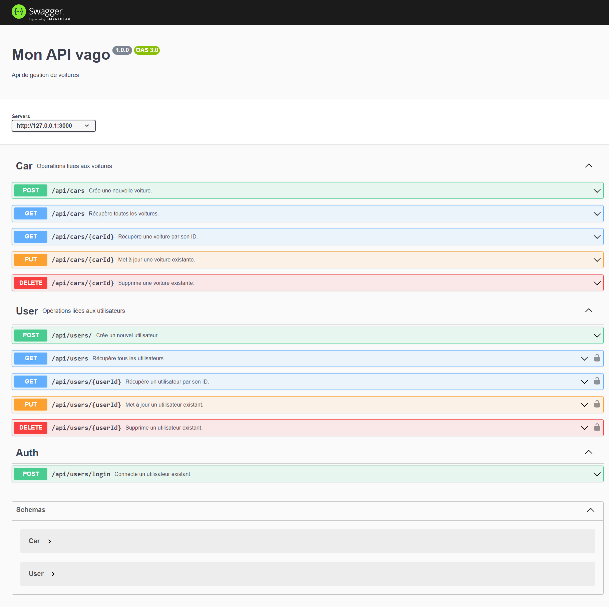

# API rest

Ceci est une API RESTful réalisée avec Node.js, Express, et MongoDB, inspirée par l'architecture MVC. Le projet comprend des tests unitaires et fonctionnels, un système de gestion d'erreurs avec fichiers de log, une authentification avec JWT, et utilise Mongoose pour interagir avec la base de données.

## Principes REST

L'API suit les cinq grands principes REST. Voici un exemple de chaque principe dans le projet :

1. **Utilisation des méthodes HTTP (GET, POST, PUT, DELETE)** 

    - Récupérer tous les utilisateurs (GET) :
    ```bash
    GET /api/users
    ```

    - Créer un nouvel utilisateur (POST) :
    ```bash
    POST /api/users
    Body : {
    "email": "john.doe@example.com",
    "password": "mypassword123"
    }
    ```

    - Mettre à jour un utilisateur existant (PUT) :
    ```bash
    PUT /api/users/:userId
    Body : {
    "email": "john.doe@example.com"
    }
    ```

    - Supprimer un utilisateur (DELETE) :
    ```bash
    DELETE /api/users/:userId
    ```

2. **Manipulation des ressources via les représentations** 


    - Représentation d'un utilisateur (le mot de passe n'est pas présenter par le controller) :
    ```bash
    {
    "_id": "60f54cfb7f9d690015c22856",
    "email": "john.doe@example.com"
    }
    ```


3. **Utilisation des URI (Uniform Resource Identifiers)** 

    - Récupérer une voiture par son ID :
    ```bash
    GET /api/cars/:carId
    ```

4. **Utilisation d'un modèle client-serveur** : L'utilisation d'Express et Mongoose dans le projet suit le modèle client-serveur. Le serveur fournit l'API REST (routes, contrôleurs) et communique avec la base de données (modèles Mongoose), tandis que le client (dans ce cas, une application front-end) consomme l'API REST pour accéder aux ressources du serveur (Postman dans le cas de nos tests).

5. **Sans état (Stateless)** : Chaque requête envoyée au serveur par le client contient toutes les informations nécessaires pour que le serveur comprenne et traite la requête. Le serveur ne garde aucune information d'état sur le client entre les requêtes. Par exemple, lorsqu'un utilisateur est authentifié via JWT, le serveur n'a pas besoin de conserver l'état de l'utilisateur ; le token JWT inclus dans chaque requête fournit toutes les informations nécessaires pour valider l'authentification.

## Architecture MVC

Le projet suit le modèle MVC avec des dossiers séparés pour les modèles, les vues et les contrôleurs.

```
|Project
	|_ dist/       		--> build typescript
	|_ logs/       		--> Fichiers de logs
	|_ node_modules/    
	|_ __tests__/           --> Fichiers de test jest
	|_ src/
		|_ /controllers     --> Controllers de l'application
		|_ /middleware  	--> Middleware pour l'auth jwt
		|_ /models     		--> Modeles mongoDB
		|_ /routes     		--> Déclaration des routes de l'application
		|-- app.ts			--> Point d'entrée de l'application
                |-- swagger.ts			--> configuration du swagger
    |-- jest.config.js			--> configuration jest
```

## Documentation API

La documentation API est générée avec Swagger.
Les annotations swaggers sont dans les controllers.

```bash
/api-docs
```



## TypeScript

Le projet utilise TypeScript pour un typage statique.
Pour compiler les fichiers Typescript, il faut utiliser la commande suivante:
```bash
tsc
```

## Syntaxe ESM

L'application utilise la syntaxe ECMAScript Modules (ESM).
Les modules sont exportés afin d'etre accessibles les uns aux autres

Exemple de l'export du module d'auth, afin d'etre accesible
```bash
export default authenticateToken;
```

## MongoDB et Mongoose

L'application est connectée à MongoDB et utilise Mongoose pour interagir avec la base de données.

## Prérequis

- Node.js 18.17
- MongoDB compass 1.37
- Express 4.18.2
- Mongoose 7.4.1

## Installation

Clonez le dépôt sur votre machine locale :

```bash
git clone mettre le repo
```

Installez les dépendances :

```bash
npm install
```

## Lancer l'application

Pour démarrer le serveur en mode développement :

```bash
npx nodemon app.ts
```

Pour démarrer le serveur en mode production (depuis le build /dist):

```bash
npm start
```

## Tests

Pour exécuter les tests unitaires, utilisez la commande suivante :

```bash
npx jest
```

## Gestion des erreurs

Toutes les erreurs sont enregistrées dans le dossier `/logs`. Vous pouvez consulter ces fichiers pour plus d'informations sur les erreurs spécifiques.

## Couche DTO

La couche DTO permet de présenter uniquement les données demandées par le client.

Exemple, on exclu les mots de passes lorsque l'on retourne les données users
```bash
const users: IUser[] = await User.find().select('-password');
```

## Contrôle des données

Les données des formulaires sont contrôlées avant d'être traitées.

Exemple, on verifie la validité du mail et la longueur du mdp avant la creation d'un user.
```bash
// Vérification de la validité d'un email
if (!isValidEmail(email)) {
    return res.status(400).json({ message: 'Email invalide' });
}
// Vérification de la longueur du mot de passe
if (password.length < 6) {
    return res.status(400).json({ message: 'Le mot de passe doit contenir au moins 6 caractères' });
}
```

## Authentification avec JWT

Le système d'authentification utilise JWT, et certaines routes sont protégées.

Exemple : on import le moddule d'auth jwt dans le router car puis on l'appel avant l'execution de la fonction createCar. Anisi uniquement les user loggé peuvent créer de nouvelles voiture.
```bash
import authenticateToken from '../middleware/authenticateToken'; 

// Route pour créer une nouvelle voiture
router.post('/',authenticateToken, createCar);
```
